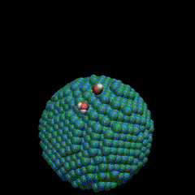
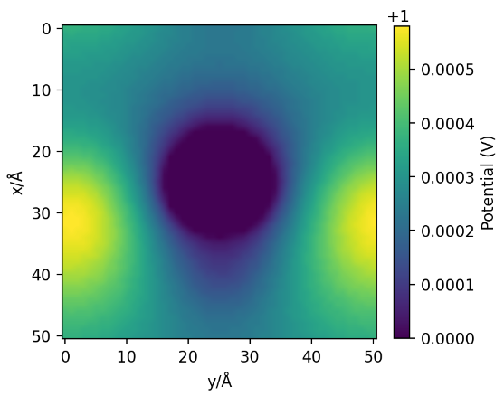

#### Finite-element-mesh with Green-integral Method for equal-potential SURFace Calculations for SPONGE （FGM-SURF）



本模块基于有限元网格方法与格林曲面积分，用于计算包含不规则等势面3DPBC体系的静电作用，用于分子动力学模拟软件SPONGE中。

#### 用法：

直接将本文件复制到SPONGE目录，替换相应文件即可。

##### Windows VS2022

本模块基于Windows 平台，Visual Studio 2022开发。若使用VS2022，请在使用原本的vs_project_generator.bat生成.sln文件后，在解决方案中手动添加FGM_surface.cu/FGM_surface.cuh两个依赖项，并手动添加cublas.lib与cusparse.lib库。修改sm_52、compute_52至 >sm_60, compute_60 （建议采用_75）。 windows环境需要格外加入-allow-unsupported-compiler 

##### Linix 平台

使用提供的MAKEFILE进行编译

```
make clean
make install
./SPONGE
```

#### to-do list

- FGM能量计算

- 适应不同形状的等势面描述

- on_the_fly 有限元网格切割算法
- 反向拓扑格林积分
- 算法加速
